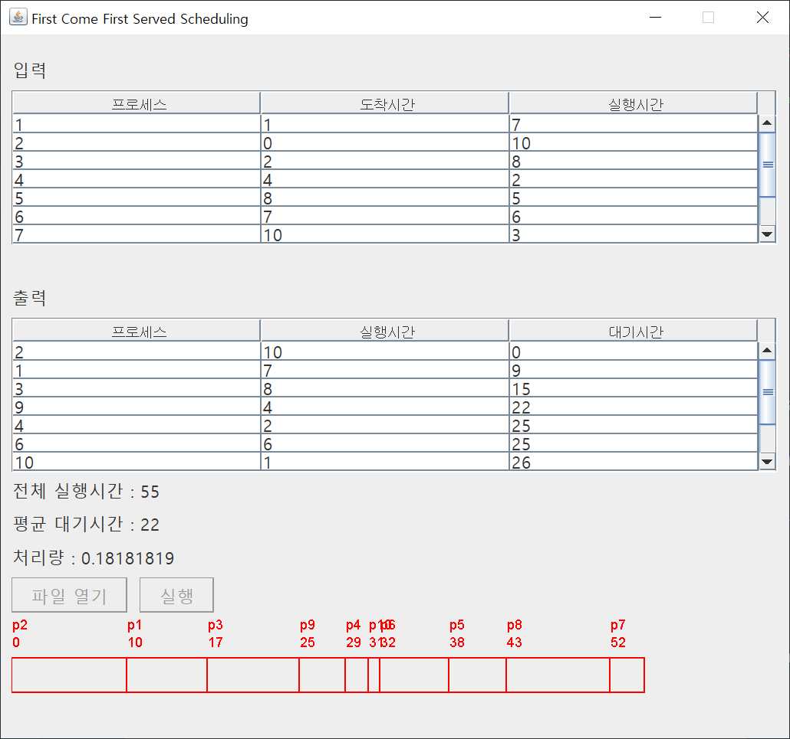

# ProcessScheduler



자바 Swing을 사용하여 만든 프로세스 스케줄러입니다.

FCFS, 비선점 SJF, 선점 SJF, RR 스케줄링을 사용할 수 있으며, 그래프로 결과를 시각적으로 보여줍니다.

## Getting Started / 어떻게 시작하나요?

Intellij로 프로젝트를 열고 프로젝트를 빌드하여 실행하시면 됩니다.

입력 값은 프로젝트 폴더에 포함된 scheduling.txt 파일을 열면 자동으로 입력됩니다.

### Prerequisites / 선행 조건

아래 사항들이 설치가 되어있어야 합니다.

```
JDK 1.8 이상, Intellij
```

## Built With / 누구랑 만들었나요?

* [박세훈](https://github.com/psh3253) - 프로젝트 전체 설계 및 제작

## Function / 기능
+ First Come First Served
+ Non-preemptive Shortest Job First
+ Preemptive Shrotest Job First
+ Round Robin
+ 파일로 입력
+ 스케줄링 결과를 그래프로 시각화

## Technology / 기술


+ Swing을 사용하여 GUI 구현

## License / 라이센스

이 프로젝트는 GPL-3.0 라이센스로 라이센스가 부여되어 있습니다. 자세한 내용은 LICENSE 파일을 참고하세요.
